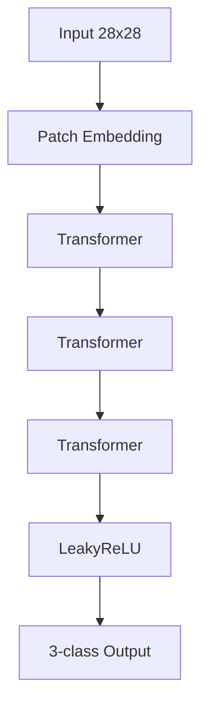
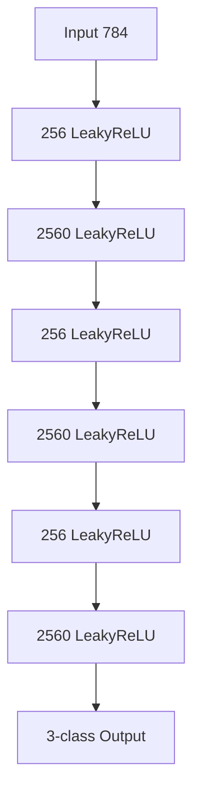
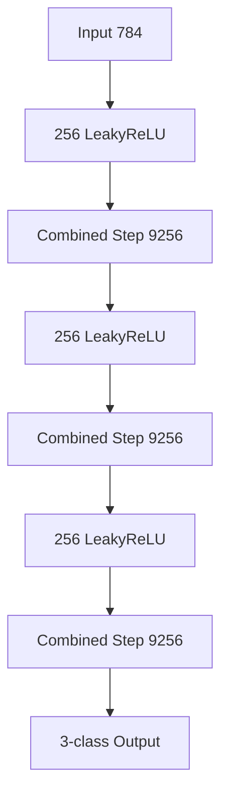
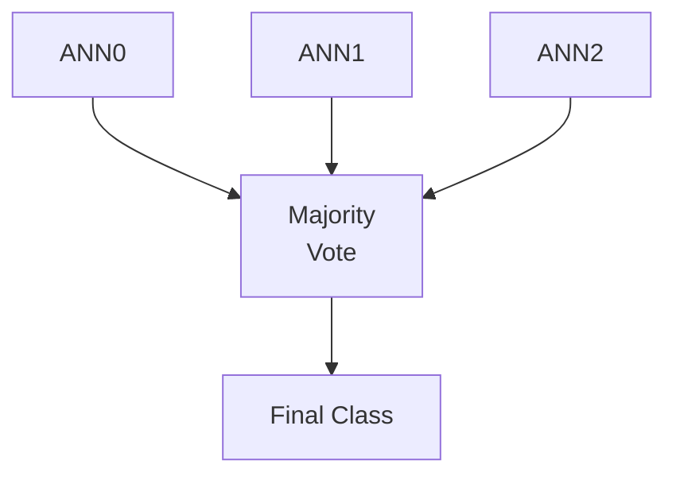
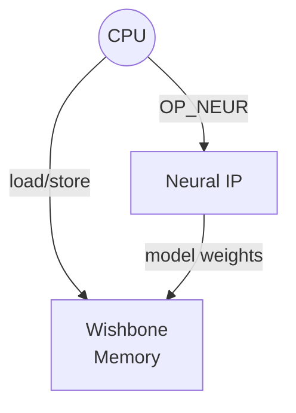
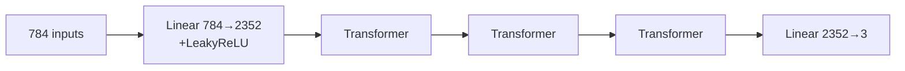
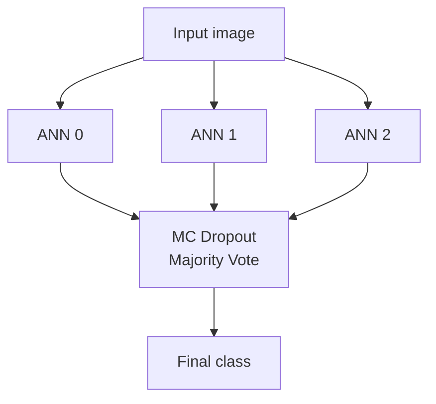
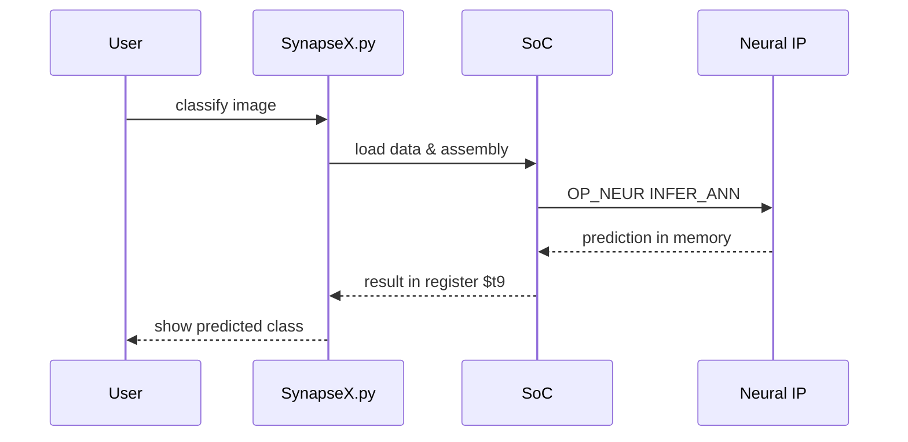

# SynapseX

SynapseX is a small System-on-Chip (SoC) simulator paired with image-processing
and neural-network utilities.  It runs simple assembly programs to exercise a
virtual CPU and a neural accelerator used for training and classifying
hand-written characters.

## Features

- **Assembly-driven SoC.** Programs in the `asm/` directory exercise the
  emulated hardware or launch neural-network operations.
- **Graphical interface.** `python SynapseX.py gui` opens a Tk GUI to edit and
  execute assembly files, load images and inspect results.
- **Training and inference.** Neural networks can be trained on a directory of
  labelled images or used to classify a single image from the command line.
- **Evaluation metrics.** Training curves track loss, accuracy, precision,
  recall and F1 while a confusion matrix visualises classification results.

## Getting Started

```bash
pip install -r requirements.txt
python SynapseX.py gui                # launch the GUI
python SynapseX.py train data/        # train on images in data/
python SynapseX.py classify img.png   # classify an image
```

## Machine Learning Algorithms

SynapseX bundles several neural architectures and ensemble techniques:

- **Transformer classifier.** Patch embeddings feed a stack of transformer
  encoder layers followed by a linear head.
- **Leaky‑ReLU feed‑forward network.** Deep fully connected layers with
  `LEAKYRELU` activations.
- **Combined‑step network.** Alternates dense layers with the custom
  `COMBINED_STEP` operation.
- **Monte Carlo dropout.** Dropout is kept active during inference and multiple
  stochastic forward passes are averaged to approximate Bayesian inference.
- **Majority voting.** Predictions from several ANNs are combined to
  yield a robust final prediction.

### Principal ANN Topologies

#### ANN0 – Transformer Classifier



#### ANN1 – Dense LeakyReLU Network



#### ANN2 – Combined‑Step Network



### Majority Voting



## Hyperparameters

The behaviour of the neural networks and training process is controlled by a set of tunable values. Their defaults and roles are documented in [HYPERPARAMETERS.md](HYPERPARAMETERS.md).

## Architecture

The project models a minimal SoC composed of a CPU, wishbone memory and a
neural accelerator.  The CPU executes a small subset of MIPS‑like instructions
and forwards neural‑network commands to the accelerator via the `OP_NEUR`
instruction.



## Machine Learning Algorithms

SynapseX bundles several machine‑learning techniques that can be composed from
assembly instructions:

- **VirtualANN** – a configurable feed‑forward network built from linear layers
  with LeakyReLU activations and dropout regularisation.
- **Transformer classifier** – images are split into patches and processed by a
  lightweight transformer encoder before classification.
- **Ensemble voting** – multiple ANNs predict with Monte Carlo dropout; their
  outputs are averaged for a majority decision.

The example `training.asm`/`classification.asm` programs configure three
distinct ANNs.  ANN 0 mixes dense layers with stacked transformer blocks, ANN 1
alternates wide and narrow fully connected layers, and ANN 2 experiments with a
custom `COMBINED_STEP` module.  ANN 0's topology is illustrated below:



Majority voting across the ensemble is depicted here:



## Training Process

`training.asm` orchestrates dataset preparation and iterative optimisation of each
`VirtualANN`.  Images labelled **A**, **B** and **C** are loaded from disk, shaped
into a NumPy dataset and cached for reuse.  The network then trains with PyTorch
using an Adam optimizer and cross‑entropy loss while dropout layers stay active
to support later majority voting.  After every epoch SynapseX records loss,
accuracy, precision, recall and F1 before finally plotting the curves and
serialising the model weights.

The high‑level flow is shown below:

```mermaid
flowchart TD
    A[Load & preprocess images] --> B[TensorDataset & DataLoader]
    B --> C{Epoch loop}
    C --> D[Forward pass]\nCrossEntropy
    D --> E[Backprop & Adam step]
    E --> F[Log metrics]
    F --> C
    C --> G[Generate plots & save weights]
```

## Evaluation Metrics

During training the `VirtualANN` network computes classic classification
metrics—accuracy, precision, recall and F1—alongside the loss for each epoch.
After inference a confusion matrix is printed and plotted to highlight
misclassified examples.

## Assembly Instructions

SynapseX understands a tiny instruction set sufficient for the demos:

| Instruction | Description |
|-------------|-------------|
| `HALT` | stop program execution |
| `ADDI rd, rs, imm` | add immediate to register |
| `ADD rd, rs, rt` | add registers |
| `BEQ rs, rt, label` | branch if equal |
| `BGT rs, rt, label` | branch if greater than |
| `J label` | jump to label |
| `OP_NEUR <cmd>` | issue neural‑network command (e.g. `TRAIN_ANN`, `INFER_ANN`) |

## Execution Flow

During classification the script performs the following high level steps:



## Repository Layout

- `SynapseX.py` – entry point script and GUI
- `asm/` – example assembly programs
- `synapse/` – SoC and hardware models
- `synapsex/` – image processing and neural-network helpers

## License

This project is released under the terms of the [MIT License](LICENSE).

