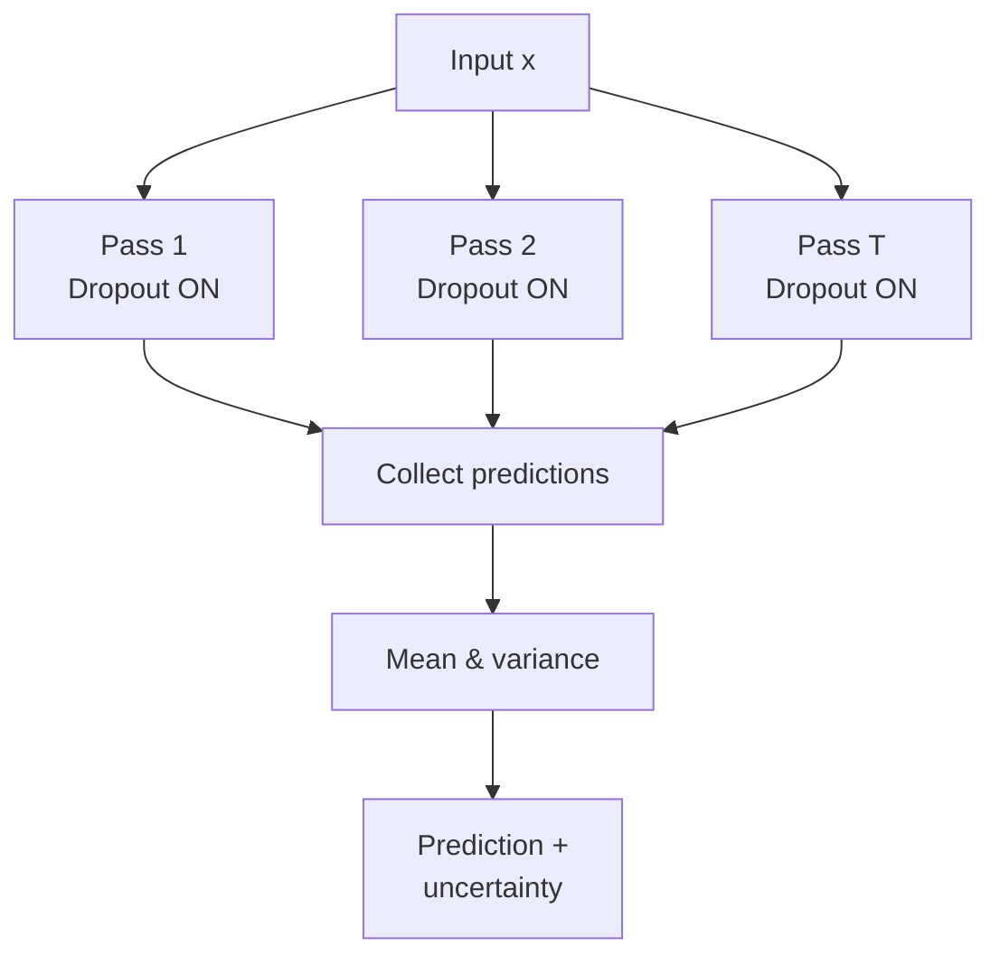
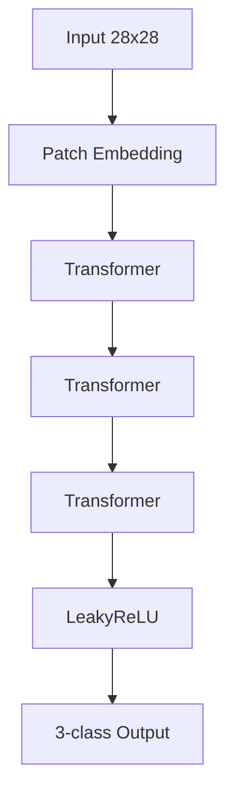
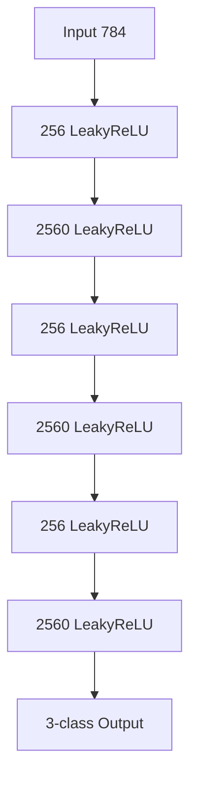
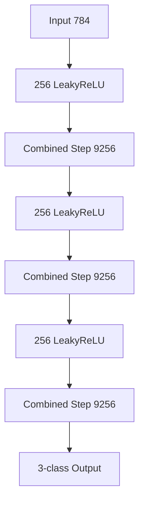
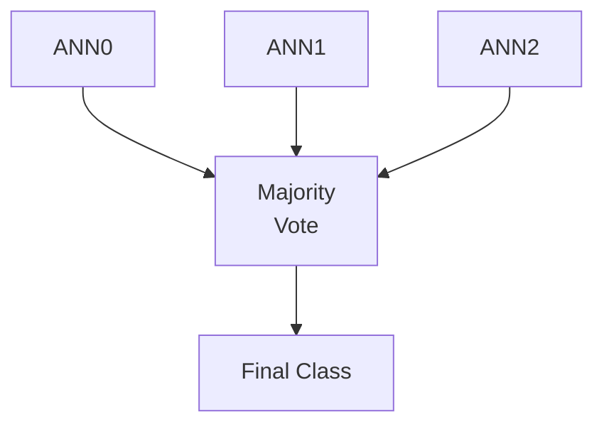
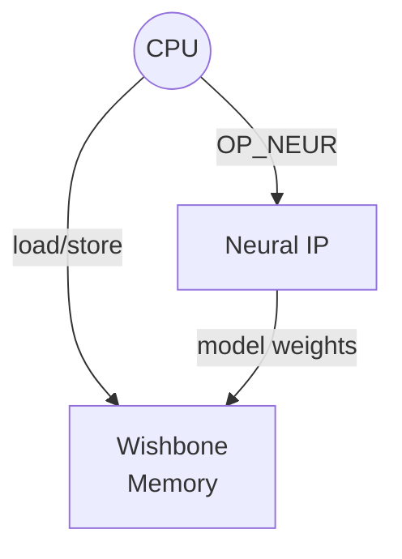
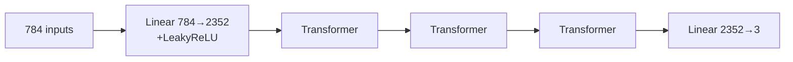
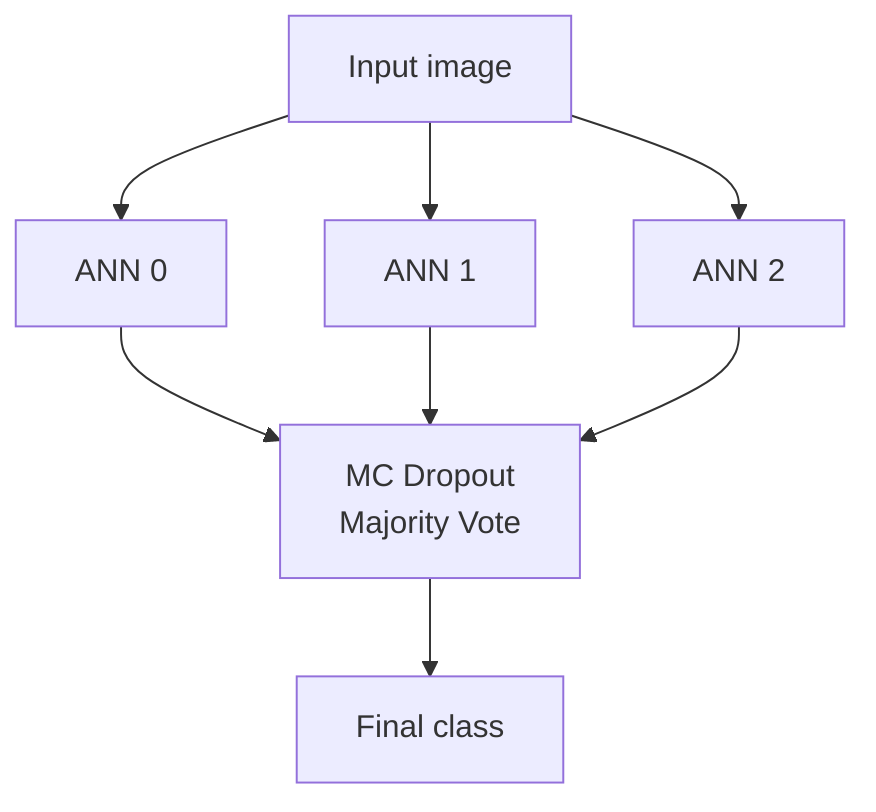
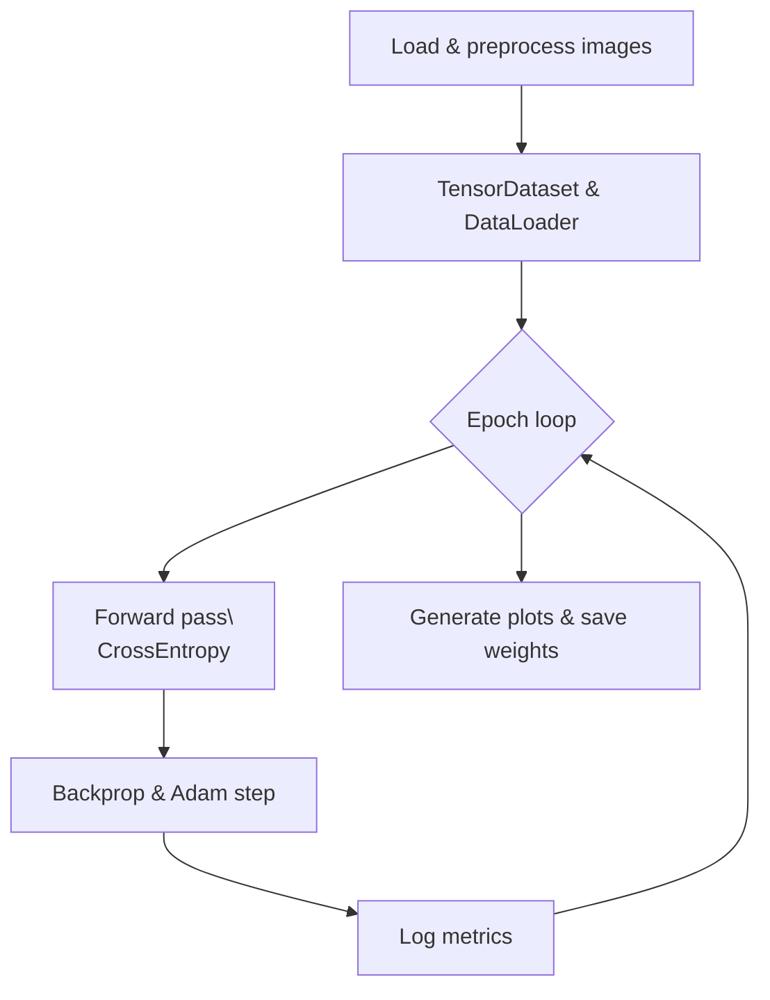
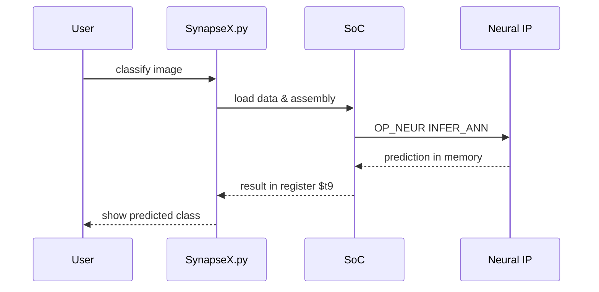

<!--
Copyright (C) 2025 Miguel Marina
Author: Miguel Marina <karel.capek.robotics@gmail.com>
LinkedIn: https://www.linkedin.com/in/progman32/

This program is free software: you can redistribute it and/or modify
it under the terms of the GNU General Public License as published by
the Free Software Foundation, either version 3 of the License, or
(at your option) any later version.

This program is distributed in the hope that it will be useful,
but WITHOUT ANY WARRANTY; without even the implied warranty of
MERCHANTABILITY or FITNESS FOR A PARTICULAR PURPOSE.  See the
GNU General Public License for more details.

You should have received a copy of the GNU General Public License
along with this program.  If not, see <https://www.gnu.org/licenses/>.
-->

# SynapseX

SynapseX is a small System-on-Chip (SoC) simulator paired with image-processing
and neural-network utilities.  It runs simple assembly programs to exercise a
virtual CPU and a neural accelerator used for training and classifying objects.

## Features

- **Assembly-driven SoC.** Programs in the `asm/` directory exercise the
  emulated hardware or launch neural-network operations.
- **Graphical interface.** `python SynapseX.py gui` opens a Tk GUI to edit and
  execute assembly files, load images and inspect results.
- **Dark mode.** The ASM editor now launches in dark mode with magenta numbers
  and can toggle to a light theme for comfortable coding.
- **Training and inference.** Neural networks can be trained on a directory of
  labelled images or used to classify a single image from the command line.
- **Evaluation metrics.** Training curves track loss, accuracy, precision,
  recall and F1 while a confusion matrix visualises classification results for
  any number of classes.
- **Validation-based early stopping.** Training monitors a held-out validation
  split, restoring the best model weights to avoid the "stuck at one class"
  behaviour and improve overall metrics.
- **Genetic algorithm tuning.** A tiny GA explores learning rates, dropout and
  transformer depth to squeeze out better accuracy, recall, precision and F1.
- **Target-metrics training.** Optimisation halts when validation F1 stalls,
  preserving the model state that achieved the strongest score.
- **Project export.** Trained ANNs, metrics and figures can be bundled into a
  JSON manifest that references per-network weight files for easy sharing.

## Getting Started

```bash
pip install -r requirements.txt
python SynapseX.py gui                # launch the GUI
python SynapseX.py train data/        # train on images in data/
python SynapseX.py classify img.png   # classify an image
```

## Vehicle Classification and Object Detection

### Preparing a classification dataset

Place images for each vehicle type in their own folder.  The folder name becomes
the class label:

```
data/vehicles/
├── class8_truck/
│   ├── img001.jpg
│   └── ...
├── car/
└── motorcycle/
```

Image file names can be arbitrary as long as they live under the correct
class-named directory.

### Training the classifier

```
python SynapseX.py train data/vehicles
```

### Loading saved weights

The `LOAD_ALL` instruction expects weight files like `weights_0.pt` and an
optional `weights_meta.json` in the working directory. Ensure these files exist
before invoking `LOAD_ALL`; otherwise a `FileNotFoundError` will be raised.

### Preparing an annotated detection dataset

`load_annotated_dataset` understands both COCO and YOLO layouts.

**COCO format**

```
dataset/
├── images/
│   ├── 0001.jpg
│   └── ...
└── annotations.json
```

**YOLO format**

```
dataset/
├── images/                # image files
├── labels/                # one .txt per image
│   └── 0001.txt           # "class x_center y_center width height" in [0,1]
```

### Training the detector

```
python examples/train_detector.py dataset/
```

This writes a `detector.pt` checkpoint using a tiny `MultiObjectDetector`.

### Running object tracking

Use the demo that chains detection and tracking:

```
python examples/multitrack_demo.py path/to/video.mp4
```

Press `q` to close the window.  If you already have detections per frame, they
can be fed to the tracker directly:

```
python SynapseX.py track detections.txt
```

Each line in `detections.txt` should contain `frame x1 y1 x2 y2` with integer
frame numbers.

## Machine Learning Algorithms

SynapseX bundles several neural architectures and ensemble techniques:

- **Transformer classifier.** Patch embeddings feed a stack of transformer
  encoder layers followed by a linear head.
- **Leaky‑ReLU feed‑forward network.** Deep fully connected layers with
  `LEAKYRELU` activations.
- **Combined‑step network.** Alternates dense layers with the custom
  `COMBINED_STEP` operation.
- **Monte Carlo dropout.** Dropout is kept active during inference and multiple
  stochastic forward passes are averaged to approximate Bayesian inference.
- **Majority voting.** Predictions from several ANNs are combined to
  yield a robust final prediction.

### Monte Carlo Dropout and Bayesian Inference (Plain English)

Monte Carlo (MC) dropout is like asking the same neural network to guess many
times while randomly forgetting parts of itself. Each time the network makes a
prediction, some neurons are "dropped" at random so the network behaves a bit
different. By averaging all of these guesses we get a more reliable final
answer.

Bayesian inference is a fancy term for reasoning about the uncertainty of those
guesses. The many MC dropout runs act like sampling from different plausible
networks. If the guesses agree, we are confident; if they vary widely, the model
is unsure. This cheap trick gives us an approximation of true Bayesian
reasoning without heavy mathematics.

#### Step-by-step

1. **Train with dropout** – build your model with dropout layers and train as
   usual. Dropout randomly zeros some activations so the model does not rely on
   any single neuron.
2. **Keep dropout on for inference** – when you want a prediction, *do not*
   disable dropout.
3. **Run multiple forward passes** – feed the same input \(x\) through the
   network \(T\) times. Each pass uses a different random dropout mask, producing
   predictions \(f_{\theta_t}(x)\).
4. **Aggregate the predictions** – average the outputs to get a final guess and
   measure how far individual predictions stray from that average to estimate
   uncertainty.



#### Formulas

The averaged prediction and its uncertainty are computed as

$$\hat{y} = \frac{1}{T} \sum_{t=1}^{T} f_{\theta_t}(x)$$

$$\hat{\sigma}^2 = \frac{1}{T} \sum_{t=1}^{T} \left(f_{\theta_t}(x) - \hat{y}\right)^2$$

#### Inputs

- trained network with dropout layers
- new example \(x\)
- number of Monte Carlo passes \(T\)

#### Outputs

- mean prediction \(\hat{y}\)
- uncertainty estimate \(\hat{\sigma}\)

Each dropout mask acts like sampling a different set of weights, giving us a
lightweight Bayesian approximation with just a single trained model.

### Principal ANN Topologies

#### ANN0 – Transformer Classifier



#### ANN1 – Dense LeakyReLU Network



#### ANN2 – Combined‑Step Network



### Majority Voting



## Hyperparameters

The behaviour of the neural networks and training process is controlled by a set of tunable values. Their defaults and roles are documented in [HYPERPARAMETERS.md](HYPERPARAMETERS.md). The transformer automatically clamps the attention-head count so it divides the embedding size, avoiding configuration errors like "embed_dim must be divisible by num_heads".

## Architecture

The project models a minimal SoC composed of a CPU, wishbone memory and a
neural accelerator.  The CPU executes a small subset of MIPS‑like instructions
and forwards neural‑network commands to the accelerator via the `OP_NEUR`
instruction.



## Machine Learning Algorithms

SynapseX bundles several machine‑learning techniques that can be composed from
assembly instructions:

- **VirtualANN** – a configurable feed‑forward network built from linear layers
  with LeakyReLU activations and dropout regularisation.
- **Transformer classifier** – images are split into patches and processed by a
  lightweight transformer encoder before classification.
- **Ensemble voting** – multiple ANNs predict with Monte Carlo dropout; their
  outputs are averaged for a majority decision.

The example `training.asm`/`classification.asm` programs configure three
distinct ANNs.  ANN 0 mixes dense layers with stacked transformer blocks, ANN 1
alternates wide and narrow fully connected layers, and ANN 2 experiments with a
custom `COMBINED_STEP` module.  ANN 0's topology is illustrated below:



Majority voting across the ensemble is depicted here:



## Training Process

`training.asm` orchestrates dataset preparation and iterative optimisation of each
`VirtualANN`.  Images labelled **A**, **B** and **C** are loaded from disk, shaped
into a NumPy dataset and cached for reuse.  The network then trains with PyTorch
using an Adam optimizer and cross‑entropy loss while dropout layers stay active
to support later majority voting.  After every epoch SynapseX records loss,
accuracy, precision, recall and F1 before finally plotting the curves and
serialising the model weights.  Training is metric driven – a validation split
tracks the F1 score and halts optimisation when the metric fails to improve,
restoring the best performing weights.

The high‑level flow is shown below:



## Evaluation Metrics

During training the `VirtualANN` network computes classic classification
metrics—accuracy, precision, recall and F1—alongside the loss for each epoch.
After inference a confusion matrix is printed and plotted to highlight
misclassified examples.

## Hyper-parameter Optimisation

To squeeze out extra accuracy, recall, precision and F1 score the training
helpers incorporate a couple of classic optimisation strategies:

- **Early stopping** halts training when the F1 score fails to improve for a few
  epochs, reducing the risk of overfitting.
- **Genetic algorithms** explore different dropout, learning-rate and
  architectural choices (transformer depth and attention heads) and retain the
  best scoring network to curb false positives and negatives.  Fitness is the
  validation F1 score, so the search favours architectures that meet the target
  metric.  The compact implementation lives in `synapsex/genetic.py` and can be
  invoked via `PyTorchANN.tune_hyperparameters_ga` before calling `train`.

Trained checkpoints persist the selected hyper-parameters so classification code
can recreate the exact network structure discovered by the search.

## Assembly Instructions

SynapseX understands a tiny instruction set sufficient for the demos:

| Instruction | Description |
|-------------|-------------|
| `HALT` | stop program execution |
| `ADDI rd, rs, imm` | add immediate to register |
| `ADD rd, rs, rt` | add registers |
| `BEQ rs, rt, label` | branch if equal |
| `BGT rs, rt, label` | branch if greater than |
| `J label` | jump to label |
| `OP_NEUR <cmd>` | issue neural‑network command (e.g. `TUNE_GA`, `TRAIN_ANN`, `INFER_ANN`) |

The neural helper commands accept a few parameters to expose training
hyper‑parameters.  `CONFIG_ANN <id> FINALIZE <dropout>` sets the
network‑wide dropout rate before the ANN instance is created.  `TUNE_GA <id>
<generations> <population>` runs a small genetic algorithm to search for the
best performing network structure and learning rate.  During training
`TRAIN_ANN <id> <epochs> <lr> <batch>` runs optimisation for the given number
of epochs using the specified learning rate and batch size.

## Execution Flow

During classification the script performs the following high level steps:



## Repository Layout

- `SynapseX.py` – entry point script and GUI
- `asm/` – example assembly programs
- `synapse/` – SoC and hardware models
- `synapsex/` – image processing and neural-network helpers

## License

This project is released under the terms of the [MIT License](LICENSE).

