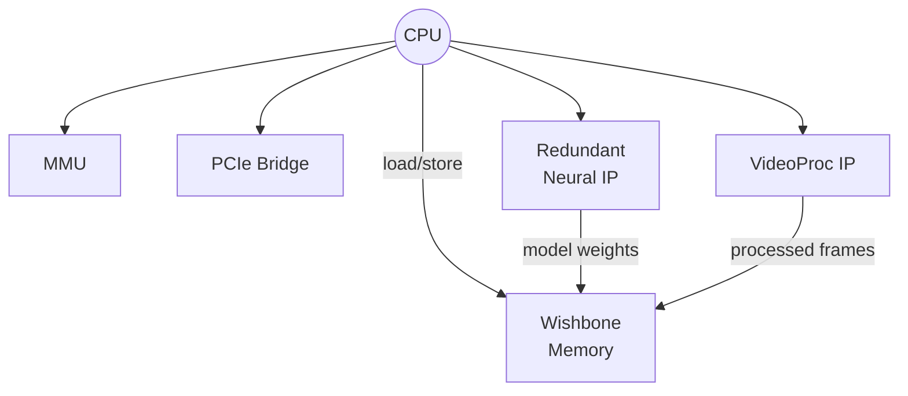
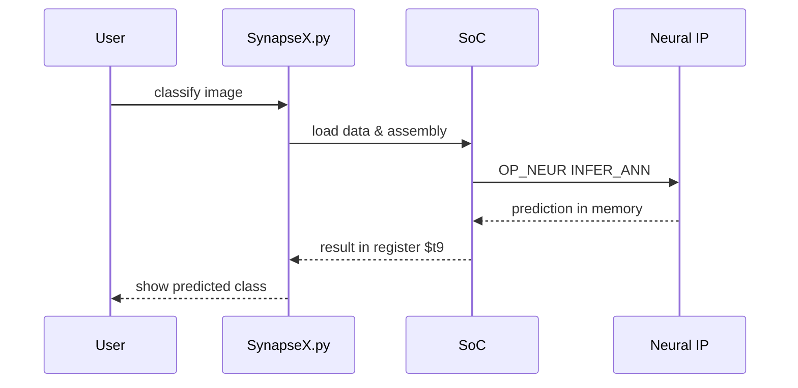

# SynapseX

SynapseX is a small System-on-Chip (SoC) simulator paired with image-processing
and neural-network utilities.  It runs simple assembly programs to exercise a
virtual CPU and a neural accelerator used for training and classifying
hand-written characters.

## Features

- **Assembly-driven SoC.** Programs stored in the `asm/` directory control the
  emulated hardware or launch neural-network operations.
- **Graphical interface.** `python SynapseX.py gui` opens a Tk GUI to edit and
  execute assembly files, load images and inspect results.
- **Training and inference.** Neural networks can be trained on a directory of
  labelled images or used to classify a single image from the command line.

## Getting Started

```bash
pip install -r requirements.txt
python SynapseX.py gui                # launch the GUI
python SynapseX.py train data/        # train on images in data/
python SynapseX.py classify img.png   # classify an image
```

## Architecture

The project models a simple SoC composed of a CPU, memory and several hardware
blocks.  The CPU executes a small subset of MIPS‑like instructions and forwards
neural‑network commands to the accelerator via the `OP_NEUR` instruction.



## Execution Flow

During classification the script performs the following high level steps:



## Repository Layout

- `SynapseX.py` – entry point script and GUI
- `asm/` – example assembly programs
- `synapse/` – SoC and hardware models
- `synapsex/` – image processing and neural-network helpers

## License

This project is released under the terms of the [MIT License](LICENSE).

